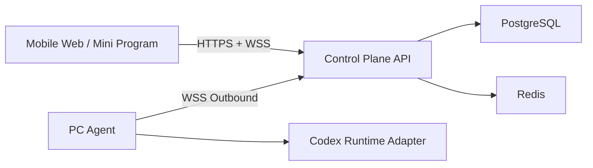
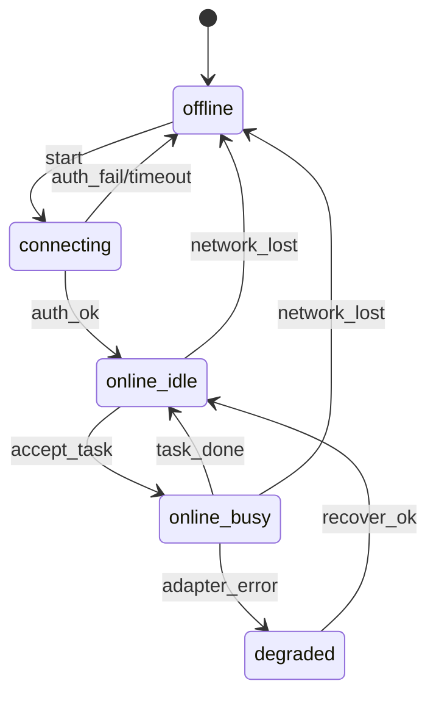

---
CCOS-Index:
  id: arch-remote-codex-control-mvp-20260303
  domain: architecture
  tags: [remote-control, codex, mobile, web, mvp]
  related:
    - ../../protocol/p0-rules.md
    - ../decisions/adr-20260303-cloud-control-plane.md
  created: 2026-03-03
  updated: 2026-03-03
---

# 手机跨网络远程控制 PC Codex（MVP）技术方案

## 1. 目标与边界

### 目标

1. 手机在任意网络（含 4G/5G）可监督 PC 上 Codex 任务。
2. 支持发送提示词、查看日志、执行停止/重试/继续。
3. 首期 Web 控制台，后续同后端协议扩展到小程序。

### 非目标（MVP 不做）

1. 不做全量远程桌面。
2. 不做复杂多人工作流审批。
3. 不做离线批量同步。

## 2. 架构概览



### 组件职责

1. `Mobile Web / 小程序`
- 登录鉴权、设备与任务展示。
- 发送命令、接收状态与日志推送。

2. `Control Plane`
- 身份认证、设备绑定、命令路由、审计留痕。
- 指令幂等、超时处理、消息 ACK。

3. `PC Agent`
- 常驻进程，主动外连云端，穿透 NAT。
- 负责把远程命令转换为本地 Codex 执行动作。

4. `Codex Runtime Adapter`
- 统一抽象 CLI/API/PTY 三类驱动方式。
- 对外暴露一致任务接口，屏蔽底层差异。

### 路线确认（2026-03-03）

1. 不采用远程桌面，保持“任务级控制”路径。
2. 采用 OpenClaw 类网关思路：手机侧发控制命令，网关转发到本机 `Codex Node`。
3. `Codex Node` 在本机声明可调用命令（例如 `session.list`、`prompt.send`、`task.stop`、`log.tail`）。

## 2.1 外网接入策略（无公网 IP）

### 优先方案：Tailscale

1. PC 与手机加入同一 tailnet。
2. 网关仅做“本机主动外连”或内网监听，不暴露家庭网络入站端口。
3. 手机通过 tailnet 地址访问网关，避免端口映射和动态公网 IP 问题。

### 备选方案：云中转入口

1. 在轻量云服务器部署控制入口（鉴权/路由/审计）。
2. 本机 Agent 主动外连云入口，手机访问云入口控制本机任务。
3. 该模式云资源消耗低于“全量云执行”，因为任务算力仍在本地 PC。

## 3. 数据模型（最小集）

### `device`

- `device_id`
- `user_id`
- `hostname`
- `agent_version`
- `status` (`online`/`offline`/`degraded`)
- `last_seen_at`

### `task`

- `task_id`
- `device_id`
- `source` (`mobile`/`pc_local`)
- `status` (`queued`/`running`/`succeeded`/`failed`/`cancelled`/`timeout`)
- `prompt_excerpt`
- `created_at` / `updated_at`

### `command`

- `command_id` (幂等键)
- `task_id`
- `action` (`prompt`/`stop`/`resume`/`retry`)
- `payload_json`
- `status` (`accepted`/`dispatched`/`acked`/`done`/`failed`)

### `audit_event`

- `event_id`
- `actor` (`user`/`agent`)
- `event_type`
- `target_id`
- `result`
- `created_at`

## 4. REST API 草案

### 认证

1. `POST /api/v1/auth/login`
2. `POST /api/v1/auth/refresh`

### 设备与任务

1. `GET /api/v1/devices`
2. `GET /api/v1/devices/{device_id}`
3. `GET /api/v1/tasks?device_id={device_id}&status={status}`
4. `GET /api/v1/tasks/{task_id}`
5. `GET /api/v1/tasks/{task_id}/logs?cursor={cursor}&limit={n}`

### 命令控制

1. `POST /api/v1/tasks/{task_id}/commands`
- body:
```json
{
  "command_id": "cmd_20260303_001",
  "action": "prompt",
  "payload": {
    "text": "继续执行并给出风险清单"
  }
}
```

2. `POST /api/v1/tasks/{task_id}/control`
- `action`: `stop` | `resume` | `retry`

### 审计

1. `GET /api/v1/audit/events?target_type=task&target_id={task_id}`

## 5. WebSocket 消息协议草案

### 连接与订阅

1. 客户端连接：`wss://{host}/ws/v1?token=...`
2. 订阅：
```json
{
  "type": "subscribe",
  "request_id": "sub_001",
  "topics": ["device:all", "task:task_123"]
}
```

### 消息统一包络

```json
{
  "type": "task.log",
  "request_id": "req_123",
  "ts": "2026-03-03T03:30:00Z",
  "device_id": "dev_001",
  "task_id": "task_123",
  "payload": {}
}
```

### 事件类型（MVP）

1. `device.online` / `device.offline`
2. `task.status.changed`
3. `task.log`
4. `command.ack`
5. `command.result`
6. `error`
7. `heartbeat`

## 6. Agent 状态机



### 任务状态机

`queued -> dispatched -> running -> (succeeded | failed | cancelled | timeout)`

## 7. 安全控制（必须）

1. 手机端登录使用短期访问令牌 + 刷新令牌。
2. Agent 使用设备证书或一次性配对码绑定。
3. 命令白名单，仅允许受控 action。
4. 每条命令必须带 `command_id`，后端做幂等去重。
5. 全链路记录审计事件，至少保留 90 天。

## 8. 实施阶段（建议）

1. Phase 0（1 周）：协议冻结（API/WS/状态机/错误码）。
2. Phase 1（2 周）：后端 + Agent 打通最小闭环。
3. Phase 2（1 周）：Web MVP（任务列表 + 日志 + 发送提示词）。
4. Phase 3（1 周）：安全加固（鉴权、限流、审计、告警）。
5. Phase 4（1 周）：小程序壳接入复用 API。

## 9. 当前待确认

1. Codex 目标运行方式优先级：`CLI > API > PTY` 是否成立。
2. 首期是否只做单用户单设备，再扩展多设备。
3. 小程序阶段是否引入 RBAC 多成员协同。
4. 审计日志落地周期和合规要求。
