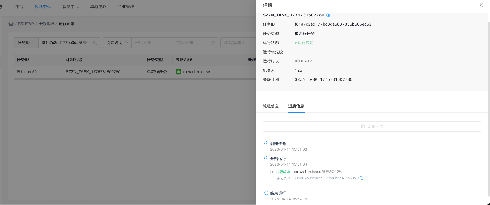
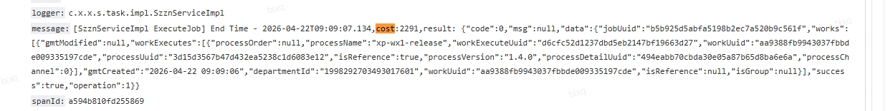

- 小鹏项目总结
	- 关于需要小鹏方协作配合、优化的地方
		- 小鹏内部信息对其，有些问题需要xp方内部沟通对齐好，不应该所有人遇到问题都问我方开发人员，有些问题需要重复跟不同人员同步
		- 一些设备环境状态、app运行状态、网络问题等流程稳定运行的前置条件需要xp内部先确认好，而不应该一出现回调超时就找我方开发人员
		- 一些非流程的问题需比如入参问题以及人为干扰问题应尽量避免，进入运维期后这些如果交由我方都需要提交工单、计算运维工时
	- 关于运营平台问题
		- 运营平台待处理问题
			- 整点运行问题（已沟通同步）
			  collapsed:: true
				-
			- 日志显示问题
			  collapsed:: true
				- 
			- 接口响应慢问题
			  collapsed:: true
				- 
	- 关于塔斯app产品问题