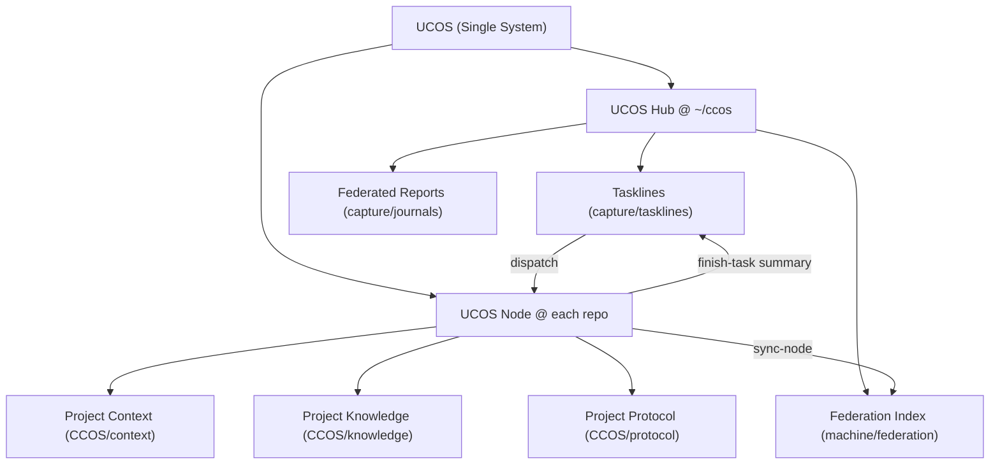

# 一体化体系重构评审（草案）

日期：2026-03-03
状态：待审核

## 1. 目标重述

你的目标不是“把两个目录凑在一起”，而是建立一个**单一心智模型**：

1. 人和 AI 都只需要理解一个体系。
2. 项目执行不失焦（在项目目录做事）。
3. 跨项目管理可统一（在 `~/ccos` 汇总、路由、审计）。
4. 工具链（初始化、校验、同步、日报）是同一套命令语义，而不是分散脚本。

## 2. 当前设计问题（真实痛点）

### 2.1 命名割裂

- `CCOS` 与 `CCOS` 容易被理解为并列方案，产生“本轮该走哪套”的选择成本。
- 当技能、AGENTS、脚本分别描述时，AI 很容易出现策略漂移。

### 2.2 工具链割裂

- `init_kcos_protocol.py` 只负责项目内 `CCOS` 初始化。
- `ccos_p0.py` 只校验单仓 `CCOS`。
- `~/ccos` 侧有联邦聚合与日报脚本，但尚未形成统一 CLI 入口。

### 2.3 规范多源

- 规范同时分布在：`AGENTS.md`、全局技能、项目 CCOS 协议、CCOS 文档。
- 没有“单一协议源 + 适配层”的严格模型时，版本漂移几乎必然发生。

### 2.4 执行可控性不足

- 仅靠“提示词约定”无法保证稳定遵守。
- 缺少“命令级强约束”和“失败即阻断”的治理机制。

## 3. 命名合并方案（建议）

你希望合并成一个新名称，这一步是必要的。

### 3.1 候选名称

1. `UCOS`（Unified Cognitive Operating System）
2. `FCOS`（Federated Cognitive Operating System）
3. `CCOS`（Context & Cognition Operating System）

### 3.2 推荐

推荐 `UCOS`。

原因：

1. “Unified”直接表达“去割裂、单一体系”。
2. 能覆盖你当前所有理念：项目执行 + 联邦治理 + 人机协作。
3. 对外沟通成本最低，语义中性，不限制未来形态。

### 3.3 概念映射（迁移期）

- `CCOS` => `UCOS Hub`（中枢治理层）
- `CCOS` => `UCOS Node`（项目执行层）

说明：迁移期允许目录名兼容保留（例如项目中继续保留 `CCOS/`），但文档与命令语义统一为 `UCOS`。

## 4. 一体化架构（统一心智模型）

关键规则：

1. 所有任务都必须同时落在 `Node + Hub` 两层。
2. 项目代码与项目知识只在 Node 处理。
3. 跨项目路由、汇总、审计只在 Hub 处理。

## 5. 脚本体系重构（必须做）

你的判断是对的：初始化与同步脚本必须升级为统一模式。

### 5.1 目标

从“分散脚本”升级为统一命令入口：`ucosctl`。

### 5.2 命令设计（建议）

1. `ucosctl init-node --root <repo_root>`
   - 初始化项目执行层目录与协议（兼容当前 CCOS 结构）。
2. `ucosctl validate-node --root <repo_root>`
   - 校验项目层协议与知识约束。
3. `ucosctl sync-node --root <repo_root>`
   - 生成项目索引（兼容 `.index.json`）。
4. `ucosctl register-node --pcos-root ~/ccos --project-id ... --repo-root ... --ccos-node ...`
   - 节点注册到中枢。
5. `ucosctl sync-hub --pcos-root ~/ccos`
   - 聚合多节点索引。
6. `ucosctl report --pcos-root ~/ccos`
   - 生成联邦日报。
7. `ucosctl start-task / finish-task`
   - 强制三字段：`project_id / repo_root / ccos_node`。

### 5.3 兼容策略

- 保留旧脚本作为兼容包装器：
  - `init_kcos_protocol.py` -> 转调 `ucosctl init-node`
  - `ccos_p0.py` -> 转调 `ucosctl validate-node/sync-node`
- 在 1-2 个迭代窗口后再考虑彻底退役旧入口。

## 6. 规范治理：AGENTS 与 Skills 的正确关系

你提的点非常关键。

正确模型：

1. 协议源（单一真理）：`~/ccos/meta/ccos-unified-protocol.md`
2. `AGENTS.md`：仓库适配层（高优先级执行约束）
3. 全局 Skills：任务工作流层（操作方法与产出契约）

这意味着：

- 不能只靠技能做治理。
- 也不能只靠 AGENTS。
- 必须“协议源 -> AGENTS/Skills 双向引用”。

## 7. 人与 AI 友好性评估

### 7.1 对人是否友好

优势：

1. 心智负担下降：只记住 `UCOS` 一套体系。
2. 日常执行更自然：在项目目录做事，不被中枢噪声干扰。
3. 全局可见性增强：任务线、索引、日报统一可追踪。

风险：

1. 早期会有命令迁移成本。
2. 双层回写若缺自动化会感觉“多一步”。

应对：

- 用 `start-task / finish-task` 把额外步骤自动化。

### 7.2 对 AI 是否友好

优势：

1. 入口清晰：先识别 `project_id/repo_root/ccos_node`。
2. 上下文更干净：执行在项目目录，减少无关扫描。
3. 协议不二义：CCOS 与 CCOS 不再可选。

风险：

1. 多源文档若不同步，AI 仍会困惑。

应对：

- 协议版本号 + 一致性检查（lint）+ 失败阻断。

## 8. 市面同类产品对比（可借鉴点）

> 这里选择“与你问题同型”的产品：知识库、AI自动化、联邦集成、数据主权。

### 8.1 Notion（AI workspace + agents + connectors）

可借鉴：

1. “工作流内嵌 AI”而不是外挂工具。
2. 权限与来源引用机制（减少幻觉式引用）。
3. Agent 与连接器统一入口。

提醒：

- 强云中心化；你的体系要保留本地项目自治优势。

参考：

- https://www.notion.com/ai
- https://www.notion.com/releases

### 8.2 Obsidian（本地 Markdown + 插件生态）

可借鉴：

1. 本地文件长期可迁移。
2. 插件化扩展能力。
3. 链接网络与数据库化视图共存（Bases）。

参考：

- https://obsidian.md/
- https://help.obsidian.md/bases

### 8.3 Anytype（local-first + key ownership）

可借鉴：

1. 数据与密钥所有权明确。
2. 离线优先 + p2p 同步设计。

参考：

- https://anytype.io/
- https://doc.anytype.io/anytype-docs

### 8.4 Mem（AI 自组织知识 + API/MCP）

可借鉴：

1. 自动组织与检索体验。
2. 通过 API/MCP 与外部 AI 工具接通。

参考：

- https://get.mem.ai/
- https://docs.mem.ai/

### 8.5 Tana（结构化节点 + AI 自动化 + MCP）

可借鉴：

1. 强结构化（类似你的 taskline/node 模式）。
2. AI 自动化与事件触发结合。
3. 本地 API + MCP 打通外部工具。

参考：

- https://tana.inc/
- https://tana.inc/docs/tana-ai

### 8.6 MCP 标准与 OpenAI 工具连接

可借鉴：

1. 协议化能力发现与调用。
2. 安全与审批模型（尤其是外部工具调用）。

参考：

- https://modelcontextprotocol.io/specification/
- https://platform.openai.com/docs/guides/tools-remote-mcp

## 9. 大方向判断

结论：你的整体方向没有大问题，反而是正确方向。

真正的问题在于：

1. 概念命名未统一。
2. 协议/技能/AGENTS/脚本未完全收敛。
3. 缺少统一命令入口与强约束执行闭环。

所以应当“重构执行系统”，而不是“推翻理念”。

## 10. 建议整改路线（分阶段）

### Phase 1：命名与协议统一（1 周）

1. 冻结新名：`UCOS`。
2. 发布统一协议 V1。
3. 技能与 AGENTS 全量引用统一协议。

### Phase 2：脚本统一（1-2 周）

1. 实现 `ucosctl` 最小命令集。
2. 旧脚本全部做兼容包装器。
3. 增加协议一致性检查脚本。

### Phase 3：执行闭环硬化（1 周）

1. `start-task / finish-task` 强制执行。
2. 未回写中枢则阻断“任务完成态”。
3. 加入联邦健康巡检。

### Phase 4：体验优化（持续）

1. 减少人工回写步骤。
2. 优化日报质量与去噪。
3. 逐步引入事件驱动自动化。

## 11. 待你拍板的关键决策

1. 是否确定新统一名称为 `UCOS`？
2. 是否接受“目录兼容保留 + 语义先统一”的迁移策略？
3. 是否授权进入下一步：`ucosctl` 设计与脚本落地（我可直接开始写第一版）？

## 12. 与 Codex 等 AI 产品重合度与冗余评估（新增）

日期：2026-03-03  
评估口径：以官方产品文档为准，判断“平台已有能力”与“UCOS 应自建能力”的边界。

### 12.1 结论先行

当前设计存在冗余风险，但方向可修正，不需要推翻：

1. 冗余主要在“通用 Agent 能力层”（提示词治理、通用记忆、通用工具编排）重复建设。
2. 你的真正差异化价值在“项目联邦治理层”（跨仓任务线、索引、审计、日报可追踪）。
3. 只要把 UCOS 收敛到“治理内核 + 适配器”，AI 困惑会明显下降。

### 12.2 平台能力 vs UCOS 边界矩阵

| 能力域 | Codex/同类产品现状 | 若 UCOS 重复实现的风险 | 建议边界 |
| --- | --- | --- | --- |
| 代码执行与代理流程 | Codex/Cursor/Claude Code/Copilot 都已支持 Agent 执行、仓库级指令文件、工具调用与自动化流程 | 双重编排导致冲突（AI 不知道听哪一层） | 交给平台；UCOS 只定义任务元数据与完成判定 |
| 仓库级行为约束 | `AGENTS.md`、`CLAUDE.md`、Rules/Instructions 已是行业共识 | 同时维护多套近似规则，漂移必然发生 | 保留一份协议源，AGENTS/Skills 只做适配引用 |
| 长短期记忆/上下文 | ChatGPT Projects、Cursor Memories、Claude memory 都提供记忆机制 | 自建通用记忆会与平台记忆打架 | UCOS 只保存“可审计任务事实”，不重做通用记忆 |
| 工具连接层 | MCP 与官方工具连接已可复用 | 自建工具网关增加维护成本 | UCOS 聚焦“工具调用策略与审计”，不重造连接协议 |
| 跨项目联邦索引 | 主流产品通常以单仓或单工作区为主，跨仓治理较弱 | 这是你的核心优势，不应下沉给平台 | 作为 UCOS Hub 核心保留并强化 |
| 联邦日报与任务闭环 | 平台可生成总结，但不天然具备你的组织化任务线语义 | 若不保留会丢失治理价值 | 作为 UCOS 差异化能力保留 |

### 12.3 冗余来源与 AI 困惑点

1. 名称层：`CCOS`/`CCOS` 双术语并存，AI 可能误判为二选一。
2. 规则层：协议、AGENTS、Skills 多源且重复叙述，容易漂移。
3. 脚本层：`kcos_*` 与 `pcos_*` 并行脚本造成“多入口同义”。
4. 存储层：若 Hub 与 Node 都写业务细节，边界失守后会污染检索。

### 12.4 去冗余的最小内核（建议）

把 UCOS 收敛为 5 个不可替代能力，其余交给平台：

1. `统一协议源`：`~/ccos/meta/ccos-unified-protocol.md`（后续可更名 `ucos-unified-protocol.md`）。
2. `节点注册表`：`~/ccos/machine/federation/project-registry.json`。
3. `联邦索引聚合`：`~/ccos/machine/federation/ccos-index-federated.json`。
4. `任务线中枢`：`~/ccos/capture/tasklines/**`（仅路由与摘要，不写项目实现细节）。
5. `统一命令入口`：`ucosctl`（Node 操作 + Hub 操作 + 完成态校验）。

### 12.5 应删除/下沉的内容（第一批）

1. 删除项目内本地技能副本，统一使用全局技能单源（已在 `rpa-mobile` 落地，可扩展到其他仓）。
2. 把旧脚本改为兼容壳，不再新增 `kcos_*`/`pcos_*` 平行脚本族。
3. 删除“通用能力重复规则”段落，规则文本保留引用，不重复拷贝。
4. 禁止 Hub 侧承载项目业务逻辑正文，避免成为第二知识库。

### 12.6 对人和 AI 的友好性判断

1. 对人：统一入口后学习成本下降，但前期需要命令迁移与习惯切换。
2. 对 AI：边界清晰后冲突显著下降，尤其是“项目目录执行 + Hub 回写摘要”的固定闭环。
3. 实施关键：把约束从“建议”升级为“命令级失败即阻断”。

### 12.7 外部参考（官方文档）

- OpenAI Codex（云端并行任务、AGENTS.md、可配置环境与工具）：https://openai.com/index/introducing-codex/
- OpenAI Codex 更新节奏与能力演进（2025-2026）：https://help.openai.com/en/articles/6825453-chatgpt-release-notes
- OpenAI Tools + Remote MCP（官方工具连接范式）：https://platform.openai.com/docs/guides/tools-remote-mcp
- Anthropic Claude Code（CLAUDE.md、hooks、MCP、命令体系）：https://docs.anthropic.com/en/docs/claude-code/overview
- Cursor 官方文档（Rules、Background Agents、MCP、Memories）：https://docs.cursor.com/
- GitHub Copilot Coding Agent 与仓库级指令：https://docs.github.com/en/copilot

## 13. 新增拍板项（冗余治理）

1. 是否同意“UCOS 只保留治理内核，通用 Agent 能力全部交给平台”？
2. 是否同意把“规则正文单源”落在 `~/ccos/meta`，AGENTS/Skills 只保留引用与仓库适配差异？
3. 是否授权我下一步输出 `ucosctl` 的命令规格草案（含旧脚本兼容映射表）？
